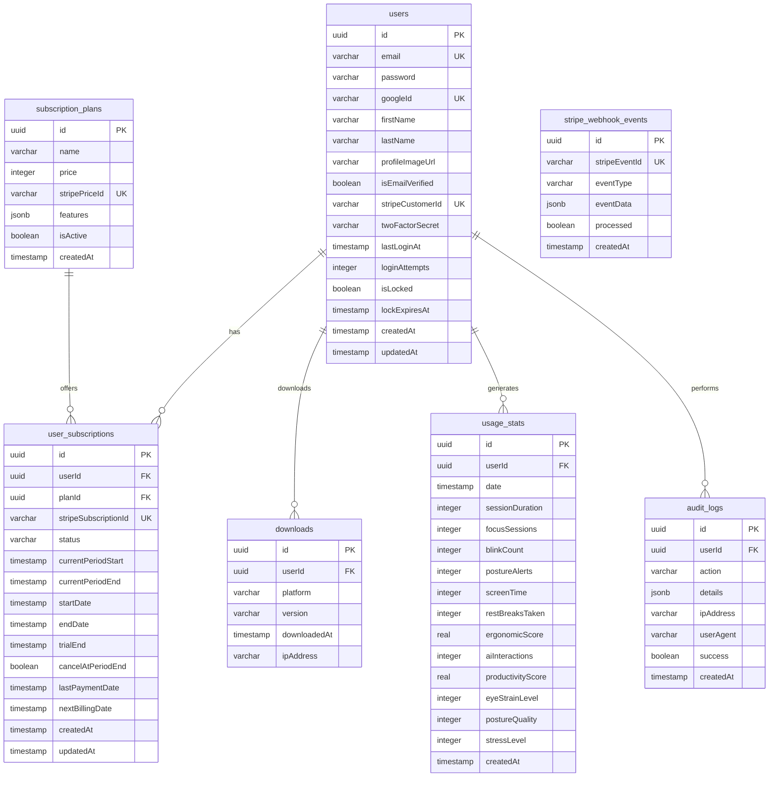

# deskAI Database Schema Documentation

## Overview
The deskAI application uses PostgreSQL as its primary database with Drizzle ORM for type-safe database operations. The schema is designed to support a desktop application that tracks user health metrics, provides focus session features, and manages subscription-based access.

**Important**: This application uses UUIDs for all primary keys and foreign keys to enhance security and prevent enumeration attacks.

## Database Configuration
- **ORM**: Drizzle ORM with PostgreSQL
- **Connection**: Configured via `DATABASE_URL` environment variable
- **Schema Location**: `./shared/schema.ts`
- **Migrations**: Generated in `./migrations` directory
- **ID Strategy**: UUID v4 for all primary keys (security-focused)

## Table Structure

### 1. Sessions Table (`sessions`)
Stores user session data for authentication persistence.

| Column | Type | Constraints | Description |
|--------|------|-------------|-------------|
| `sid` | varchar | Primary Key | Session identifier |
| `sess` | jsonb | Not Null | Session data (serialized) |
| `expire` | timestamp | Not Null | Session expiration timestamp |
| - | - | Index on `expire` | Optimizes session cleanup |

**Purpose**: Manages user authentication sessions, similar to Redis session storage.

### 2. Users Table (`users`)
Core user account information supporting multiple authentication methods with enhanced security features.

| Column | Type | Constraints | Description |
|--------|------|-------------|-------------|
| `id` | uuid | Primary Key, Default: random() | Unique user identifier (UUID v4) |
| `email` | varchar | Unique, Not Null | User's email address |
| `password` | varchar | Nullable | Hashed password (for email/password auth) |
| `googleId` | varchar | Unique, Nullable | Google OAuth identifier |
| `firstName` | varchar | Nullable | User's first name |
| `lastName` | varchar | Nullable | User's last name |
| `profileImageUrl` | varchar | Nullable | URL to profile picture |
| `isEmailVerified` | boolean | Default: false | Email verification status |
| `stripeCustomerId` | varchar | Unique, Nullable | Stripe customer identifier |
| `twoFactorSecret` | varchar | Nullable | 2FA secret for optional two-factor authentication |
| `lastLoginAt` | timestamp | Nullable | Last successful login timestamp |
| `loginAttempts` | integer | Default: 0 | Failed login attempts counter |
| `isLocked` | boolean | Default: false | Account lock status |
| `lockExpiresAt` | timestamp | Nullable | Account lock expiration timestamp |
| `createdAt` | timestamp | Default: now() | Account creation timestamp |
| `updatedAt` | timestamp | Default: now() | Last update timestamp |

**Indexes**: 
- `IDX_users_email_verified` on (email, isEmailVerified)
- `IDX_users_google_id` on (googleId)

**Purpose**: Central user management with enhanced security features including 2FA, account locking, and login tracking.

### 3. Subscription Plans Table (`subscription_plans`)
Defines available subscription tiers and their features.

| Column | Type | Constraints | Description |
|--------|------|-------------|-------------|
| `id` | uuid | Primary Key, Default: random() | Plan identifier (UUID v4) |
| `name` | varchar | Not Null | Plan name (e.g., "Basic", "Pro") |
| `price` | integer | Not Null | Price in cents |
| `stripePriceId` | varchar | Unique, Nullable | Stripe price identifier |
| `features` | jsonb | Not Null | Plan features (JSON array) |
| `isActive` | boolean | Default: true | Whether plan is available |
| `createdAt` | timestamp | Default: now() | Plan creation timestamp |

**Purpose**: Manages subscription tiers with flexible feature definitions stored as JSON.

### 4. User Subscriptions Table (`user_subscriptions`)
Tracks user subscription status and history with comprehensive Stripe integration.

| Column | Type | Constraints | Description |
|--------|------|-------------|-------------|
| `id` | uuid | Primary Key, Default: random() | Subscription record ID (UUID v4) |
| `userId` | uuid | FK → users.id, Not Null | Associated user (UUID) |
| `planId` | uuid | FK → subscription_plans.id, Not Null | Associated plan (UUID) |
| `stripeSubscriptionId` | varchar | Unique, Nullable | Stripe subscription identifier |
| `status` | varchar | Not Null | Status: 'active', 'cancelled', 'expired', 'past_due', 'trialing' |
| `currentPeriodStart` | timestamp | Nullable | Current billing period start |
| `currentPeriodEnd` | timestamp | Nullable | Current billing period end |
| `startDate` | timestamp | Default: now() | Subscription start date |
| `endDate` | timestamp | Nullable | Subscription end date |
| `trialEnd` | timestamp | Nullable | Trial period end date |
| `cancelAtPeriodEnd` | boolean | Default: false | End-of-period cancellation flag |
| `lastPaymentDate` | timestamp | Nullable | Last successful payment date |
| `nextBillingDate` | timestamp | Nullable | Next scheduled billing date |
| `createdAt` | timestamp | Default: now() | Record creation timestamp |
| `updatedAt` | timestamp | Default: now() | Last update timestamp |

**Indexes**:
- `IDX_user_subscriptions_status` on (userId, status, endDate)
- `IDX_user_subscriptions_period` on (currentPeriodStart, currentPeriodEnd)

**Purpose**: Manages user subscription lifecycle with comprehensive Stripe integration and billing period tracking.

### 5. Stripe Webhook Events Table (`stripe_webhook_events`)
Tracks Stripe webhook events for audit and debugging purposes.

| Column | Type | Constraints | Description |
|--------|------|-------------|-------------|
| `id` | uuid | Primary Key, Default: random() | Event record ID (UUID v4) |
| `stripeEventId` | varchar | Unique, Not Null | Stripe's event identifier |
| `eventType` | varchar | Not Null | Type of webhook event |
| `eventData` | jsonb | Not Null | Complete event payload |
| `processed` | boolean | Default: false | Processing status |
| `createdAt` | timestamp | Default: now() | Event received timestamp |

**Indexes**:
- `IDX_webhook_events_type` on (eventType, processed)

**Purpose**: Ensures webhook idempotency and provides audit trail for Stripe events.

### 6. Downloads Table (`downloads`)
Tracks application downloads across different platforms.

| Column | Type | Constraints | Description |
|--------|------|-------------|-------------|
| `id` | uuid | Primary Key, Default: random() | Download record ID (UUID v4) |
| `userId` | uuid | FK → users.id, Nullable | User who downloaded (if logged in) |
| `platform` | varchar | Not Null | Platform: 'mac', 'windows', 'linux' |
| `version` | varchar | Not Null | Application version |
| `downloadedAt` | timestamp | Default: now() | Download timestamp |
| `ipAddress` | varchar | Nullable | IP address of downloader |

**Indexes**:
- `IDX_downloads_platform_date` on (platform, downloadedAt)

**Purpose**: Analytics and usage tracking for application distribution.

### 7. Usage Statistics Table (`usage_stats`)
Stores comprehensive user behavior and health metrics.

| Column | Type | Constraints | Description |
|--------|------|-------------|-------------|
| `id` | uuid | Primary Key, Default: random() | Stats record ID (UUID v4) |
| `userId` | uuid | FK → users.id, Not Null | Associated user (UUID) |
| `date` | timestamp | Default: now() | Date of usage |
| `sessionDuration` | integer | Nullable | Session duration in minutes |
| `focusSessions` | integer | Nullable | Number of focus sessions |
| `blinkCount` | integer | Nullable | Number of blinks detected |
| `postureAlerts` | integer | Nullable | Posture correction alerts |
| `screenTime` | integer | Nullable | Total screen time in minutes |
| `restBreaksTaken` | integer | Nullable | Number of rest breaks taken |
| `ergonomicScore` | real | Nullable | Calculated ergonomic health score (0-100) |
| `aiInteractions` | integer | Nullable | Number of AI assistant interactions |
| `productivityScore` | real | Nullable | Calculated productivity score (0-100) |
| `eyeStrainLevel` | integer | Nullable | Eye strain level (1-10 scale) |
| `postureQuality` | integer | Nullable | Posture quality (1-10 scale) |
| `stressLevel` | integer | Nullable | Stress level (1-10 scale) |
| `createdAt` | timestamp | Default: now() | Record creation timestamp |

**Indexes**:
- `IDX_usage_stats_user_date` on (userId, date)
- `IDX_usage_stats_health` on (ergonomicScore, productivityScore)

**Purpose**: Comprehensive tracking of user health metrics, productivity patterns, and application usage for analytics and personal insights.

### 8. Audit Logs Table (`audit_logs`)
Comprehensive audit trail for critical user actions and system events.

| Column | Type | Constraints | Description |
|--------|------|-------------|-------------|
| `id` | uuid | Primary Key, Default: random() | Log record ID (UUID v4) |
| `userId` | uuid | FK → users.id, Nullable | Associated user (nullable for system actions) |
| `action` | varchar | Not Null | Action type: 'login', 'subscription_changed', 'profile_updated', etc. |
| `details` | jsonb | Nullable | Additional context about the action |
| `ipAddress` | varchar | Nullable | IP address of the action |
| `userAgent` | varchar | Nullable | User agent string |
| `success` | boolean | Default: true | Whether the action was successful |
| `createdAt` | timestamp | Default: now() | Action timestamp |

**Indexes**:
- `IDX_audit_logs_user_action` on (userId, action, createdAt)
- `IDX_audit_logs_action_date` on (action, createdAt)

**Purpose**: Provides comprehensive audit trail for security, compliance, and debugging purposes.

## Relationships



## Key Features

### Enhanced Security System
- **Dual Authentication**: Supports both email/password and Google OAuth
- **Two-Factor Authentication**: Optional 2FA with secret storage
- **Account Locking**: Automatic account lockout after failed attempts
- **Session Management**: Persistent sessions with expiration
- **Email Verification**: Optional email verification workflow
- **UUID-based IDs**: Prevents user enumeration attacks
- **Comprehensive Audit Trail**: All critical actions logged

### Advanced Subscription Management
- **Stripe Integration**: Complete Stripe customer and subscription tracking
- **Flexible Plans**: JSON-based feature definitions
- **Status Tracking**: Active, cancelled, expired, past_due, and trialing states
- **Billing Periods**: Comprehensive billing period tracking
- **Trial Support**: Trial period management
- **End-of-Period Cancellation**: Graceful subscription termination

### Comprehensive Analytics & Tracking
- **Download Analytics**: Cross-platform download tracking with IP logging
- **Health Metrics**: Eye strain, posture, stress level monitoring
- **Productivity Tracking**: Focus sessions, AI interactions, productivity scoring
- **Ergonomic Monitoring**: Comprehensive ergonomic health scoring
- **Usage Patterns**: Screen time, rest breaks, session duration tracking

### Performance Optimization
- **Strategic Indexing**: Composite indexes for common query patterns
- **UUID Performance**: Optimized UUID indexing for efficient lookups
- **Analytics Optimization**: Indexed health and productivity metrics
- **Audit Performance**: Efficient audit log querying

## Data Types and Constraints

### Primary Keys
- **UUID Strategy**: All tables use UUID v4 primary keys
- **Security Benefits**: Prevents enumeration attacks and ID guessing
- **Global Uniqueness**: UUIDs are globally unique across all environments
- **No Sequential Exposure**: Users cannot guess other user IDs

### Foreign Keys
- **UUID References**: All foreign keys reference UUID primary keys
- **Proper referential integrity** with cascade options
- **Nullable foreign keys** where appropriate (e.g., anonymous downloads, system audit logs)

### Indexes
- **Session expiration index** for cleanup operations
- **Unique constraints** on email, Google ID, and Stripe identifiers
- **Composite indexes** for common query patterns
- **Performance indexes** for analytics and audit queries

### JSON Fields
- `features` in subscription_plans: Flexible feature definitions
- `sess` in sessions: Serialized session data
- `eventData` in stripe_webhook_events: Complete webhook payloads
- `details` in audit_logs: Action-specific context

## API Endpoints

The database is accessed through the following API endpoints:

- `GET /api/subscription-plans` - Fetch available plans
- `POST /api/downloads` - Track application downloads
- `GET /api/downloads/stats` - Download statistics
- `GET /api/usage-stats` - User usage data (protected)
- `PUT /api/profile` - Update user profile (protected)
- `PUT /api/change-password` - Password management (protected)
- `POST /api/upload-profile-picture` - Profile picture upload (protected)
- `POST /api/2fa/enable` - Enable two-factor authentication (protected)
- `POST /api/2fa/verify` - Verify 2FA code (protected)
- `GET /api/audit-logs` - User audit trail (protected, admin)

## Security Considerations

1. **Password Hashing**: Passwords are hashed using bcrypt
2. **Two-Factor Authentication**: Optional 2FA with secure secret storage
3. **Account Locking**: Automatic lockout after failed login attempts
4. **Session Security**: Sessions expire automatically
5. **Authentication Required**: Sensitive endpoints require authentication
6. **File Upload Security**: Profile pictures are validated and size-limited
7. **SQL Injection Prevention**: Drizzle ORM provides parameterized queries
8. **UUID-based Security**: All IDs use UUIDs to prevent enumeration attacks
9. **Comprehensive Audit Trail**: All critical actions logged with context
10. **IP Address Tracking**: Login attempts and actions tracked by IP

## Migration Strategy

- Schema changes are managed through Drizzle migrations
- Migrations are generated in the `./migrations` directory
- Database URL is configured via environment variables
- Schema versioning is handled automatically by Drizzle
- **UUID Migration**: If migrating from sequential IDs, requires data migration strategy

## Performance Considerations

1. **UUID Indexes**: UUIDs are indexed efficiently in PostgreSQL
2. **Composite Indexes**: Strategic indexing for common query patterns
3. **JSON Queries**: Efficient JSONB operations for flexible data
4. **Connection Pooling**: PostgreSQL connection pooling via node-postgres
5. **Query Optimization**: Drizzle ORM optimizes query generation
6. **Analytics Performance**: Indexed health and productivity metrics
7. **Audit Performance**: Efficient audit log querying with composite indexes

## Compliance Considerations

1. **GDPR Compliance**: Data retention policies and user consent tracking
2. **Data Anonymization**: Mechanisms for data anonymization/deletion
3. **Audit Trail**: Comprehensive logging for compliance requirements
4. **Security Logging**: Failed login attempts and suspicious activity tracking
5. **Data Portability**: User data export capabilities

## Scaling Considerations

1. **Partitioning**: Usage_stats can be partitioned by date for large-scale analytics
2. **Time-Series Data**: Consider time-series database for high-volume metrics
3. **Data Archiving**: Implement archiving strategy for old audit logs and usage records
4. **Read Replicas**: Consider read replicas for analytics queries
5. **Caching**: Implement caching for frequently accessed subscription data

## UUID Implementation Details

### PostgreSQL UUID Extension
```sql
-- Ensure UUID extension is enabled
CREATE EXTENSION IF NOT EXISTS "uuid-ossp";
```

### Drizzle ORM Configuration
```typescript
// UUID fields use defaultRandom() for automatic generation
id: uuid("id").primaryKey().defaultRandom()
```

### Type Safety
- All UUID fields are typed as `string` in TypeScript
- Drizzle ORM handles UUID validation and conversion
- No manual UUID generation required in application code

---

*This documentation reflects the enhanced deskAI database schema with comprehensive security, analytics, and audit capabilities.*
